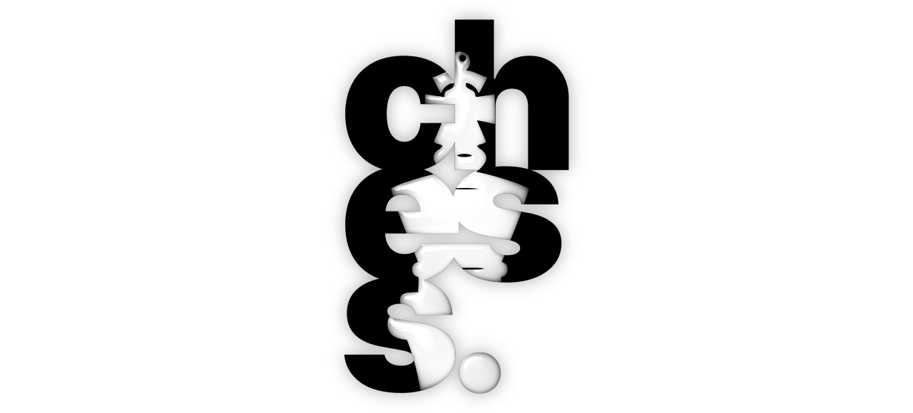

# chess-art

<i>Logo made with Inkscape and Inter Tight Heavy font.</i>

chess artworks.  

## applications used

1. inkscape
2. krita

## notes

1. `.assets` has the logo WEBP and SVG.
2. rest of the directories are project dirs.
3. output PNGs are stored in `output` directory of the respective projects.